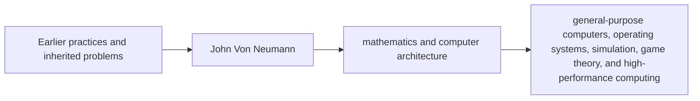

# John Von Neumann — influence

> Validation ID: VIA-HIST-JOHN-VON-NEUMANN-INFLUENCE  
> Version: 2.0  
> Last reviewed: 2026-07-09

## Directed influence graph

## Influenced by
John Von Neumann should be read against earlier tools, teachers, texts, institutions, and technical needs. Influence is strongest when a source shows direct reading, correspondence, apprenticeship, translation, patronage, or explicit criticism.

## People and fields influenced
Later influence appears when a method is reused outside its original setting. The most important successors are often not biographical admirers but engineers, scientists, mathematicians, teachers, and institutions that turned the method into routine practice.

## Controversies and caution
Influence claims are easy to overstate. Similar ideas can arise independently when communities face similar constraints. Reliable influence requires chronology plus transmission evidence.

## Primary works and authoritative sources
- First Draft of a Report on the EDVAC (1945).
- Theory of Games and Economic Behavior.
- MacTutor History of Mathematics, University of St Andrews.
- Encyclopaedia Britannica author-reviewed historical entries.
- Nobel Prize official materials, ACM A.M. Turing Award materials, IEEE History Center, NASA History, Royal Society Biographical Memoirs, national libraries, museum archives, university editions, and recognized history-of-science books where applicable.

## Traceability standard
Major claims should be checked against primary texts, scholarly editions, official prize biographies, university archives, academy memoirs, or peer-reviewed historical studies. Conflicting dates, attributions, transliterations, and priority disputes should be recorded rather than hidden.
