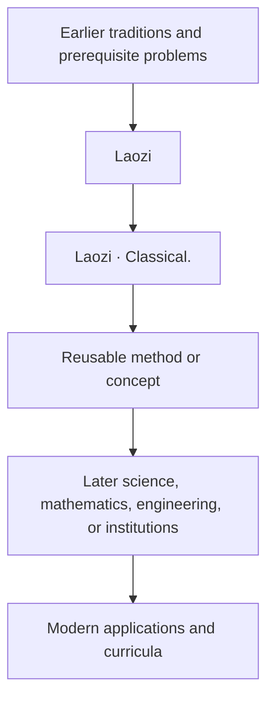

# Laozi — influence

- **Validation ID:** VIA-HIST-LAOZI-INFLUENCE
- **Version:** 1.1
- **Last reviewed:** 2026-07-09
- **Repository source:** `data/entities.json`; profile path `people/laozi/` where available
- **Research source list:** see `references.md` in this package; claims not already present in local metadata are marked for authoritative source expansion before further historical enlargement.

## Engineering summary
Influence is represented as a directed relationship: prerequisites flow into Laozi; Laozi's contribution flows into later theories, technologies, or institutions.

## Historical summary
The verified local contribution marker is: Laozi · Classical..

## Directed knowledge graph

## Influenced by
- Earlier practitioners in philosophy.
- The mathematical, scientific, philosophical, political, or institutional vocabulary available in the Classical period.
- Practical constraints that required a more reliable way to reason, compute, measure, organize, or build.

## People influenced
Specific successors require source-backed expansion. The local knowledge graph should only name successors when a traceable source supports the lineage.

## Competing theories and interpretations
Historical interpretation may be contested. Competing claims should be recorded with attribution rather than forced into a single narrative.

## Cross references
- **Prerequisites:** earlier nodes in `../knowledge-graph.md`.
- **Related people:** adjacent figures in the same field and period.
- **Successors:** downstream users of the contribution.
- **Repository links:** `data/entities.json`; profile path `people/laozi/` where available.

## Modern relevance
The influence graph helps readers see engineering evolution as a chain of constraints, abstractions, and reuse rather than as isolated biographies.
