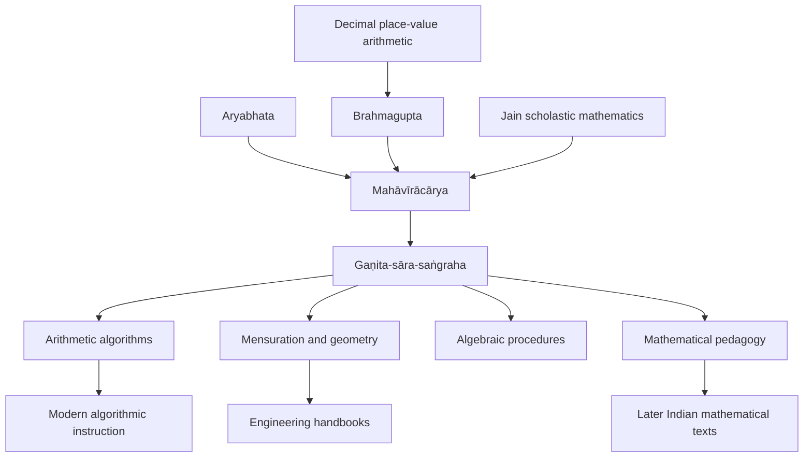

# Mahāvīrācārya — influence

- **Validation ID:** VIA-HIST-MAHAVIRACHARYA-INFLUENCE
- **Version:** 1.1
- **Last reviewed:** 2026-07-09
- **Repository source:** `data/entities.json` entry `Mahaviracharya`; profile path `people/Mahaviracharya/`
- **Research source list:** M. Rangacarya's 1912 English translation of *The Ganita-sara-sangraha of Mahaviracarya*; MacTutor History of Mathematics biography; Mathematical Association of America Convergence note on Rangacarya's translation; NCTM historical article on *The Ganita-Sara-Sangraha of Mahaviracarya*.

## Engineering summary
Mahāvīrācārya sits in the lineage from Indian astronomical computation and algebra to later mathematical handbooks and algorithmic pedagogy.

## Historical summary
His work did not begin a tradition from nothing. It selected, clarified, and reorganized inherited mathematics into a mathematics-centered treatise.

## Directed knowledge graph

## Influenced by
- Earlier Indian mathematical astronomy and arithmetic.
- Brahmagupta's algebraic and geometric techniques.
- Jain intellectual traditions that valued classification, large numbers, and systematic exposition.

## People and traditions influenced
- Later South Indian mathematical pedagogy.
- Translators and historians who reconstructed Indian computational mathematics through Rangacarya's edition.
- Modern educators using historical algorithms to show that computation has multiple cultural lineages.

## Cross references
- **Prerequisites:** Aryabhata, Brahmagupta, place-value arithmetic.
- **Related people:** Bhāskara II, al-Khwarizmi, Fibonacci.
- **Successors:** mathematical handbook traditions and algorithmic education.
- **Repository links:** `data/entities.json`; `people/Mahaviracharya/`.

## Modern relevance
Influence is best understood as transmission of method. Mahāvīrācārya's enduring contribution is the conversion of mathematical knowledge into a navigable procedure graph.
